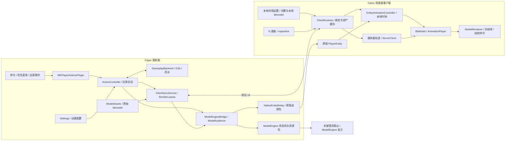
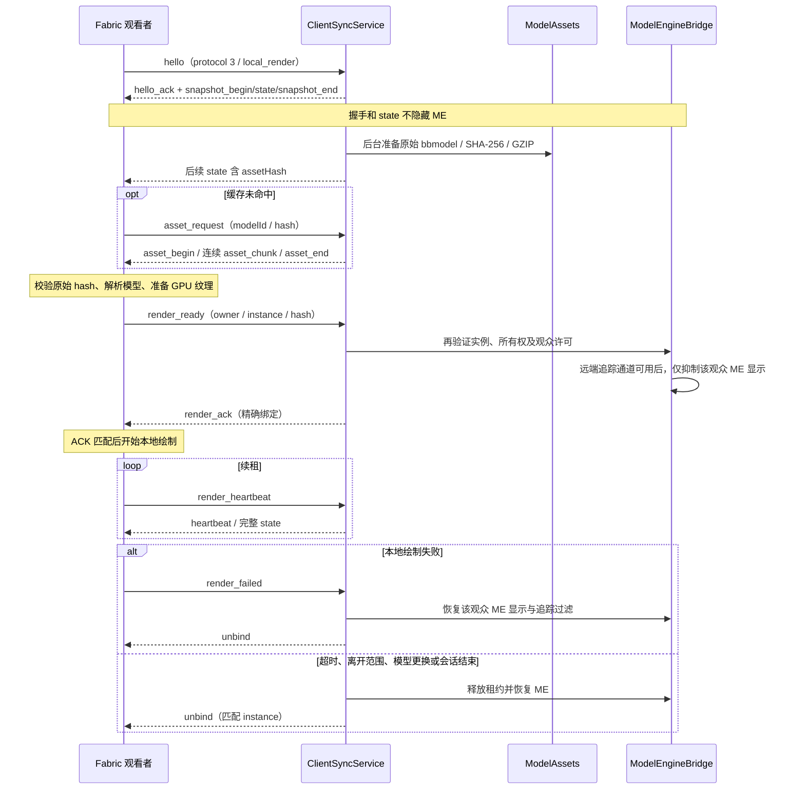

# MEPlayerActions 整体设计架构

本文依据当前工作区 0.4.0 的服务端插件、Fabric 客户端及测试代码整理，描述已实现的机制。客户端目标为 Fabric / Minecraft 1.21.11、Java 21；服务端插件目标为 Paper 1.21.11、ModelEngine R4.1.1，GSit 为可选姿态后端。构建版本、协议版本与配置版本分别由 `pom.xml` / `client/build.gradle`、`ClientSyncService.PROTOCOL` / `WireJson`、`config-version` 决定；当前三者分别为 0.4.0、3、3，不应混用。

使用说明见 [README](README.md)，消息字段、限制和错误码见 [客户端协议](src/main/java/com/simmc/meplayeractions/client/CLIENT_PROTOCOL.md)。本文中的源码链接以仓库根目录为基准，源码阅读不等同于本次完成实机验收。

## 1. 系统目标与职责边界

服务端插件在真实玩家实体上创建或接管 ModelEngine 模型，并把玩家状态映射成动画。真实位置、碰撞、载具和能力仍由 Paper 及姿态后端管理；视觉延迟和模型缩放只改变显示。Fabric 客户端拥有独立的模型解释器、动画控制器和渲染器；多人伪装时，它也是可选的观看者渲染增强，不要求所有被观看者安装模组。

客户端 `fabric.mod.json` 只声明 Fabric Loader、Minecraft、Java 和 Fabric API，Gradle 不引用 ModelEngine 或 Bukkit API。共享源码限于表达式和不依赖服务器 API 的配置类型。ModelEngine、Paper 和 GSit 的版本耦合位于当前服务端适配器中，不能推导为客户端的硬依赖。

| 层级 | 负责 | 主要输入与输出 |
| --- | --- | --- |
| Paper / GSit | 真实移动、姿态、飞行、床、载具、交互事件 | 玩家实体、事件、GSit 姿态与座位锚点 |
| 服务端动作控制 | 权限、会话、同步许可、状态选择、动画映射、观众范围 | 已解析的动画层、运动策略和模型绑定 |
| ModelEngine | 模型注册、状态机动画、资源包及未接管观众的显示 | ModelEngine 显示实体和原生实体过滤 |
| 客户端通信 | 按观众传送资产与状态，验证渲染接管并管理租约 | `meplayeractions:main` 的 JSON 消息 |
| Fabric 客户端 | 解析支持的 `.bbmodel`、采样动画、上传纹理、本地绘制和动作面板 | 原版 `PlayerEntity`、服务器许可、本地渲染命令 |

本插件创建的伪装使用独立视觉枢轴，不把玩家挂载到模型上。`attach` 接管已有的 `state_machine` 模型，仅添加受管动作层，不取得原模型的销毁、观众或渲染替换所有权。

### 本地自己的外观与服务器多人伪装

`LocalAppearanceSettings` 保存本机自己的模型选择、均匀缩放和世界 X/Y/Z 偏移（方块单位、Y 正值向上），默认关闭、默认模型为 `ysm_02_jk`。配置写入 `config/meplayeractions-client.json` 的 `localAppearance`，不发送给服务器；进出世界保留配置并重新准备本地实例。模型来源为 JAR 内置两套模型或 `config/meplayeractions/models/` 的单个 `.bbmodel`，同样经过 `BbModel` 格式、原始大小和纹理预算校验，不支持外部贴图或任意路径。

本地实例仅替换本机看到的自己，按本机玩家实体运行姿态、交互和模型脚本，无需服务器绑定或握手。显式启用的本地外观优先于服务器自己的模型显示，服务器自己的绑定和租约继续独立维护，其他玩家的模型仍服从服务器许可。关闭本地外观后恢复已有的服务器本人模型，或显示原版人物；本地模型加载失败不能阻断服务器多人接管。

`options.enabled` 为客户端渲染总开关，本地外观和服务器接管均遵守；启用本地外观时同步打开总开关。关闭本地外观只关闭本地 profile，不修改总开关或服务器绑定。加载失败保留配置、显示错误，并恢复服务器/原版显示，按 30 秒间隔退避重试。本人饥饿、手持物和运动输入取本机实体，附件脚本不读取服务器本人 `a/b`。

N 面板的“本地外观”及 `/mpaclient settings` 提供模型、缩放和偏移设置；本地动作只调用本地播放/停止。服务器动作和真实姿态走原有 v3 请求及权限校验，界面只在服务器同步和本人模型就绪后启用。本轮交付基础独立客户端设置，完整 OpenYSM 界面和功能对齐留待后续迭代；其他引擎的服务端适配器也尚未实现，未来接入应复用下文 v3 约定。

## 2. 组件与数据流

### 服务端代码索引

| 模块 | 职责 | 入口 |
| --- | --- | --- |
| 插件入口 | 版本检查、初始化、权限命令、事件转发、重载与关闭 | [MEPlayerActionsPlugin](src/main/java/com/simmc/meplayeractions/MEPlayerActionsPlugin.java) |
| 配置 | 配置范围校验、状态映射、速度与过渡、自定义动作、旧配置兼容 | [Settings](src/main/java/com/simmc/meplayeractions/config/Settings.java)、[config.yml](src/main/resources/config.yml) |
| 动作控制 | 每玩家会话、三类动画层、采样、跳跃与交互、快照 | [ActionController](src/main/java/com/simmc/meplayeractions/action/ActionController.java) |
| 状态计算 | 姿态优先级、移动采样、跳跃周期、挖掘与挥臂续期 | [action/](src/main/java/com/simmc/meplayeractions/action/) |
| 真实姿态 | GSit API 适配、受管坐下/爬行、飞行字段恢复、假人可见性 | [GameplayBackend](src/main/java/com/simmc/meplayeractions/gameplay/GameplayBackend.java)、[PoseReplicaVisibility](src/main/java/com/simmc/meplayeractions/gameplay/PoseReplicaVisibility.java) |
| ME 适配 | 创建/接管模型、保留动画层句柄、共享状态恢复 | [ModelEngineBridge](src/main/java/com/simmc/meplayeractions/me/ModelEngineBridge.java) |
| 观众 | ME 跟踪过滤、最近观众名额、本地渲染观众的 ME 抑制 | [ModelAudience](src/main/java/com/simmc/meplayeractions/me/ModelAudience.java)、[AudienceSelector](src/main/java/com/simmc/meplayeractions/me/AudienceSelector.java) |
| 原版追踪 | 为就绪观众保留对应玩家的原版实体包，释放后恢复合法追踪 | [NativeEntityRelay](src/main/java/com/simmc/meplayeractions/me/NativeEntityRelay.java)、[NativeEntityRestoration](src/main/java/com/simmc/meplayeractions/me/NativeEntityRestoration.java) |
| 客户端服务 | 握手、入包校验、完整状态、资产队列和渲染租约 | [ClientSyncService](src/main/java/com/simmc/meplayeractions/client/ClientSyncService.java)、[RenderLeases](src/main/java/com/simmc/meplayeractions/client/RenderLeases.java) |
| 资产 | 异步查找 `.bbmodel`、按原始字节生成 SHA-256、GZIP 压缩与缓存 | [ModelAssets](src/main/java/com/simmc/meplayeractions/client/ModelAssets.java) |
| 动作目录 | 自定义动作别名、原始动画开关、中文名称及排序 | [ActionDirectory](src/main/java/com/simmc/meplayeractions/action/ActionDirectory.java)、[ActionMenu](src/main/java/com/simmc/meplayeractions/ui/ActionMenu.java) |

### 客户端代码索引

| 模块 | 职责 | 入口 |
| --- | --- | --- |
| 模组入口 | 注册 payload、连接事件、每 tick 更新、N 键与客户端命令 | [MEPlayerActionsClient](client/src/main/java/com/simmc/meplayeractions/client/MEPlayerActionsClient.java) |
| 运行时 | 握手和绑定生命周期、后台解码、主线程纹理安装、缓存与失败退避 | [ClientRuntime](client/src/main/java/com/simmc/meplayeractions/client/ClientRuntime.java) |
| 即时动作 | 从观看者的原版实体采样普通动作，遵守服务器运动策略 | [EntityAnimationController](client/src/main/java/com/simmc/meplayeractions/client/EntityAnimationController.java)、[LocalMotionPolicy](client/src/main/java/com/simmc/meplayeractions/client/LocalMotionPolicy.java) |
| 时间协调 | 服务器 tick 展开和估计、位置/动画历史、本地动作开始时间转换 | [ServerClock](client/src/main/java/com/simmc/meplayeractions/client/ServerClock.java)、[LocalLayerClock](client/src/main/java/com/simmc/meplayeractions/client/LocalLayerClock.java)、[TransformTimeline](client/src/main/java/com/simmc/meplayeractions/client/TransformTimeline.java)、[SnapshotTimeline](client/src/main/java/com/simmc/meplayeractions/client/SnapshotTimeline.java) |
| 模型与动画 | 有限格式解析、骨骼矩阵、关键帧插值、叠层和连续过渡 | [BbModel](client/src/main/java/com/simmc/meplayeractions/client/model/BbModel.java)、[AnimationPlayer](client/src/main/java/com/simmc/meplayeractions/client/model/AnimationPlayer.java) |
| 绘制 | 纹理预算、帧提取、视锥裁剪、冻结顶点、提交绘制命令 | [ModelRenderer](client/src/main/java/com/simmc/meplayeractions/client/render/ModelRenderer.java) |
| 原人物隐藏 | 记录隐藏标记，取消玩家与装备绘制，并控制第一人称手臂 | [mixin/](client/src/main/java/com/simmc/meplayeractions/client/mixin/) |
| 本地模型库 | 内置模型与专用目录的单文件模型，读取后使用同一受限解析器 | [LocalModelLibrary](client/src/main/java/com/simmc/meplayeractions/client/LocalModelLibrary.java) |
| 界面与选项 | 本地外观设置、分页动作面板、渲染总开关、自显；拖后参数保留在配置中 | [LocalAppearanceScreen](client/src/main/java/com/simmc/meplayeractions/client/ui/LocalAppearanceScreen.java)、[ActionsScreen](client/src/main/java/com/simmc/meplayeractions/client/ui/ActionsScreen.java)、[ClientOptions](client/src/main/java/com/simmc/meplayeractions/client/ClientOptions.java)、[LocalAppearanceSettings](client/src/main/java/com/simmc/meplayeractions/client/LocalAppearanceSettings.java) |

## 3. 动作会话与每 tick 控制

`ActionController.Session` 以玩家 UUID 索引，持有 ME `Attachment`、本次参数、动画句柄、跳跃/交互追踪器及视觉历史。每次新会话生成 `instance` UUID，用于区分同一玩家的模型生命周期；`sequence` 仅在动作或受管状态变化时增加。相同 `sequence` 的位置包仍可能变化，客户端不能只按序号丢弃它。

创建伪装先验证白名单、已加载模型与药水权限，再通过 `ModelEngineBridge` 创建显式 `state_machine` 处理器。缩放、基础人物可见性、玩家朝向模式和观众过滤器在注册时设置。创建失败执行回滚；相同参数且没有药水的重复请求可直接返回，模型或参数更换则结束旧会话。

控制任务每 tick 执行，但采样和动画切换分别受配置间隔控制，默认均为 1 tick：

1. 检查玩家在线及模型连接，更新观众和药水租用状态。
2. 采样玩家输入、位移、床、GSit、载具、水中状态和原生姿态；事件补充明确的跳跃、挥臂和挖掘信号。
3. 按移动、姿态变化、伤害、动画结束或最长时长中断手动动画；睡眠或手动动画存在时清理交互层。
4. 将坐标、朝向、姿态和跳跃周期写入同一 `VisualTimeline.Frame`，取得本次视觉历史帧。
5. 根据该帧选择姿态动画，更新受管 ME 层并生成客户端快照；同一动画和播放参数尽量复用句柄，避免每 tick 重启。

`disguise.adopt-original` 默认开启，每 20 tick 尝试接管允许模型的原生 ME 伪装。原模型必须是状态机；显式退出接管后，本次在线期间暂停对该玩家自动接管。

### 姿态选择顺序

服务端 `StateSelector` 按下列顺序处理，先匹配者优先：原生床睡眠 → GSit/观察到的睡眠 → 坐下 → 陆地爬行 → 载具 → 鞘翅 → 飞行 → 水平游泳 → 离地踩水 → 跳跃/下落 → 地面潜行 → 待机/行走/疾跑。客户端即时模式使用同类规则，GSit `specialPose` 优先于其隐藏座位载具。

某个已识别姿态被禁用时返回空自动层，不继续回退到较低姿态。例如，陆地爬行禁用不能被误识别为游泳。动画解析先使用模型专属候选，再用默认候选，选择当前模型实际存在的第一个动画；显式空列表禁用映射。

实际同步许可为 `synchronization.enabled`、服务器对应项和 `players.yml` 中玩家偏好的交集。这个许可控制本插件动画，不阻止 GSit 真实姿态，也不关闭 ME 自己的基础动作。

### 动画层

| 层 | 服务端默认优先级 | 组成与行为 |
| --- | --- | --- |
| `posture` | 100 | 自动姿态，覆盖有关键帧的通道；跳跃有最短播放与落地宽限 |
| `interaction` | 150 | 主副手挥臂、挖掘，采用叠加；挖掘由事件、目标、工具和超时控制 |
| `manual` | 200 | 命令或菜单播放；按关键帧通道覆盖，可被配置的中断条件终止 |

服务端优先级可配置，但必须保持严格递增并高于 ME 默认层。桥接层只管理自己创建的 `IAnimationProperty` 句柄，遇到外来技能占用同优先级会拒绝播放。客户端以层名保持相同的先后关系，并非直接使用这些数字。`ONCE` 播放一次、`LOOP` 循环、`HOLD` 保持末帧；客户端 `AnimationPlayer` 对层进入、替换和缺席退出保持过渡连续性。

## 4. 视觉位置与两种客户端跟随方式

服务端 `VisualTimeline` 同时延迟位置、朝向、姿态和跳跃周期，避免模型仍在空中却已经使用落地动作。`visual-follow.delay-ticks` 默认 2，单次伪装的 `delay` 可覆盖；超过最大位移、切换世界或启用的特殊姿态切换会清空历史。ME 绘制通过锁定朝向和 `BoneTransformReadEvent` 的 `VisualOffset` 使用这份视觉帧，不改真实玩家坐标。

| 模式 | 坐标与朝向 | 动画时间 | 延迟来源 |
| --- | --- | --- | --- |
| ME 路径 | 服务器共享视觉帧 | ME 状态机 | 服务端 `delay` 及网络传输 |
| 客户端即时跟随（默认） | 观看者原版 `PlayerEntity.getLerpedPos` 和帧间角度插值 | 本地 tick 采样普通动作；服务器手动层转换到本地时钟 | 原版实体网络与插值，不叠加服务器视觉历史或拖后缓冲 |
| 客户端服务器拖后轨迹 | `TransformTimeline` 的服务器视觉帧 | 同一展示 tick 上的 `SnapshotTimeline` 动画集合 | 服务端视觉历史及客户端 `interpolationTicks` |

即时模式本人读取本机玩家实体，其他玩家读取观看者世界中的追踪实体；没有追踪实体时不生成幽灵模型。服务器继续提供已解析的 `motion.clips`、有效同步项、飞行能力、明确交互状态、固定爬行/潜行姿态及 GSit 特殊锚点。本人挖掘可立即读取本地交互管理器，远端挖掘使用服务器明确状态，不能根据动画名字猜测。

`LocalLayerClock` 仅在收到不同层状态时把服务器开始时刻转换为本地时刻，同实例重复包不会重启动画。服务器 tick 在协议中以 unsigned 32 位形式传输，`ServerClock` 展开回绕并用单调时钟估计展示时间；它不保证远端实体没有网络延迟。

### 锚点与坐标约定

- 普通姿态以真实玩家脚底为锚点。
- 原生床睡眠使用床两半的几何中心、床块 Y + 9/16 和床朝向；使用独立的 `bed-sleep` 状态。
- GSit 姿态使用公共 `Seat.location + SitService.baseOffset` 接触面。即时模式下，服务器传当前接触面相对真实脚底的偏移，而非延迟帧的偏移；GSit 假床包不能作为原生床证据。
- 卧倒 Root 来自模型动画，不再次叠加原版游泳或睡眠的整模型旋转。
- `BbModel` 将 Blockbench 模型和动画位置单位统一转换为方块单位（1/16）；3.x/4.x 动画按旧格式做轴向转换。绘制统一使用 `180 - bodyYaw` 对齐模型前方，头部增量旋转在已编排骨骼旋转之后应用。

## 5. 按观众接管渲染

接管的身份是 **viewer + owner + instance + assetHash**，不是一个全局“此玩家使用客户端”的开关。`owner` 是被观看者；`viewer` 是握手的连接玩家，不由客户端消息任意指定。

`ModelAudience` 从 ME 原有跟踪条件中选择同世界、在线、`Player.canSee(owner)`、原过滤器允许的候选；严格三维距离小于单次伪装的观看距离，再按距离和 UUID 排序选取最近 N 位。本人由 `showSelf` 决定，且不占其他观众名额。本地渲染观众保留名额，只抑制自己的 ME 模型显示。`ClientSyncService` 另加通信距离检查，不能突破前面的授权范围。

只有本插件创建、没有共存外来模型、拥有可分发资产的实例才可接管。原生 ME 接管或资产尚在后台准备时，`assetHash` 为空并继续 ME 渲染。

### 为什么需要原版实体追踪通道

即时模式依赖原版 `PlayerEntity`，而 ME 隐藏基础实体时会过滤原版追踪包。远端观众 ready 后，`NativeEntityRelay` 在该观众的 Netty pipeline 中安装处理器，仅对被授权 owner 实体 ID 的出生、移动、朝向、元数据、装备、挥臂和乘客包使用 ME `ProtectedPacket`；通过公共 `forceSpawn` 初始化实体。本人无需这条远端通道。

`NativeEntityPackets` 以 1.21.11 的包结构读取实体 ID；`NativeEntityPacketHandler` 保持混合 bundle 顺序，未匹配包继续交给 ME。无法建立通道则拒绝接管并保持 ME。退租时移除对应例外和隐藏基础实体的客户端副本；解除伪装后，`NativeEntityRestoration` 只为仍被合法追踪、同世界、在线且可见的原本本地观众重新发送真实人物出生，避免恢复可见性后人物仍缺失。

## 6. 协议、资产与资源上限

通信使用 Minecraft plugin messaging / Fabric custom payload 的 `meplayeractions:main`，没有额外 HTTP 服务或数据库。协议 v3 不兼容 v1/v2；两端使用严格 UTF-8 JSON。客户端请求只能操作发送者自身，`play / stop / sit / crawl / reset` 转回服务端 `handleAction`，继续走命令权限、模型与动作校验。

v3 的线格式不传 ModelEngine 对象、骨骼实体 ID 或引擎名称。`owner`、`instance`、`assetHash`、动画层、运动映射和接管租约描述的是玩家视觉实例。其他服务端模型引擎可以实现同一协议，提供客户端支持的 `.bbmodel`、映射已支持的动作状态、保留可用的原版玩家追踪，并在 ready/ack、失败和超时时切换自己的观众显示；满足这些约定后无需因更换引擎更新客户端。本仓库当前提供的是 ModelEngine 适配器，尚未实现其他引擎后端。新模型格式、状态枚举或协议语义超出 v3 范围时仍需另行适配。

`state` 是完整状态，主要包含实例身份、视觉位置/朝向、缩放、人物隐藏、自显、三个动画层、动作目录和 `motion` 策略。缺席的层要退出；动作目录不代表免权限许可，服务器在执行时再校验。快照边界目前由客户端校验后接收，`ClientRuntime` 不做基于 `snapshot_end` 的原子批量提交，日常绑定清理由 `unbind` 和租约完成。

当前服务端 `ModelAssets` 的资产查找顺序为本插件 `models/<id>.bbmodel` → JAR 内置表达式模型 → ME `blueprints/` 的匹配文件名 → 匹配 `model_identifier`。读文件、计算 hash 和压缩在服务器异步任务中完成；准备中及失败项保留 ME。结果（含失败）缓存在当前服务实例中，更新模型后需插件 reload。hash 针对原始 JSON 字节，压缩和 Base64 仅用于传输；这份目录规则不是其他引擎适配器必须使用的目录。

客户端在后台线程读取缓存、解压、校验和解析，使用 `generation` 拒绝断开、世界切换或重载后到达的旧后台结果。纹理注册回到 Minecraft 主线程，准备成功后才允许发送 ready。

| 限制或间隔 | 当前值 / 默认值 | 目的 |
| --- | --- | --- |
| 完整状态 / 心跳 | 每 2 tick / 每 20 tick；动作变化可立即广播 | 同步位置并续租 |
| 服务端渲染租约 | 100 tick | 无有效续租时恢复 ME |
| 客户端状态/连接超时 | `leaseTicks × 50 ms`，默认约 5 秒 | 单调时间超时，不依赖世界时间推进 |
| 入包 / 入包频率 | 默认 16000 字节 / 每观众每秒最多 48 包 | 限制协议流量与解析成本 |
| 动作请求冷却 | 默认 4 tick；`stop/reset` 不占冷却 | 防止重复动作请求，保留及时停止 |
| 原始 / 压缩模型 | 8 MiB / 4 MiB | 限制资产大小与解压结果 |
| 分片与队列 | 每片最多 9000 压缩字节；每观众每 tick 最多 2 片、最多 2 个传输 | 控制下载负载 |
| 客户端绑定 / 内存模型 | 最多 64 个绑定 / 16 个模型资产 | 限制并发显示与资产驻留 |
| 模型结构 | 最多 2048 骨骼、4096 cube、16 贴图、128 动画、200000 关键帧、深度 64 | 限制解析与动画计算成本 |
| 纹理预算 | 单边 ≤4096 像素；单资产 ≤16M 像素；全体 GPU ≤32M 像素 | 限制纹理驻留 |
| 下载超时 / 失败退避 | 约 15 秒 / 30 秒 | 避免永久在途或无限快速重试 |
| 磁盘缓存清理 | 约 128 MiB 总量，按文件时间保留 | 限制旧资产占用 |

以上 tick 时长的秒数按名义 20 TPS 换算；服务器租约按服务器 tick 推进，客户端按单调时间在更新时检查。状态包过大时先删去动作目录；仍超限则解绑、保持 ME，并按观众/owner 去重日志。握手、入包、资产分片的精确约束见协议文档。

## 7. 客户端模型解析与绘制

客户端实现独立的 cube 骨骼渲染器，不依赖 OpenYSM 或 GeckoLib。支持内联 `outliner`、逐面 UV、内嵌 PNG、数值型位置/旋转/缩放轨道、linear / step / catmullrom 插值，以及 ONCE / LOOP / HOLD 播放。读取格式范围为 3.2 及以上 3.x、4.x、内联骨骼的 5.0。

外部贴图、mesh、box UV、cube rescale、分离 `groups` 表、外部粒子/音效通道和 5.1 以后格式仍拒绝加载。数字轨道支持受限 Molang：变量赋值、条件、度数三角函数、算术、常用数学函数与模型需要的 YSM/query/ctrl 输入。解释器有长度、深度、运算预算和有限数约束，不执行 Java、文件、网络或宿主代码。

`ysm_01_jk` / `ysm_02_jk` 保留各自几何、贴图、枢轴和原始尺寸。`tools/prepare_models.py` 以原始 ysm_07_jk 和基准模型补齐动作，把旧 UUID 按唯一且完全一致的骨骼名迁移；缺失的外部骨骼轨道记录在 manifest 中。原模型位于 `examples/models`，含 60 个动画与脚本；`ModelBaker` 生成 `examples/blueprints` 的 57 个数值动画供 ME 导入。不生成 NPC/player 变体。

`AnimationPlayer` 每个实例分别保存表达式变量、时间线事件进度和弹簧状态，使用原模型 parallel1 初始化与 parallel2 的 10 ms 固定积分步骤。pre_parallel 层在姿态前，parallel0 配饰层在姿态后。实际实体移动、垂直速度、转身、头部朝向、主副手与饥饿值作为输入；远端饥饿值由服务器同步。跳跃、床睡眠等动画拥有 Root 旋转，渲染器仅应用世界 yaw。

第一人称及客户端本人隐藏只跳过绘制，保留实例脚本和物理推进。服务器伪装的帽子/花朵 `variable.roaming.a/b` 由服务器当前实例同步，客户端在事件后、几何前应用，保证新观众与重新进入观看距离时状态一致；纯本地外观自行执行附件脚本，不读取服务器本人附件状态。弹簧变量继续按模型实例独立计算。服务器物理使用实际坐标差并按采样间隔归一，传送和换世界清零运动输入。

`YsmAnimations` 为每次伪装创建独立 BlueprintAnimation 和动态关键帧，不修改共享 ME 蓝图。主线程更新物理与输入，异步 ME 动画线程读取不可变快照；辅助层使用预留优先级，释放时仅停止自己持有的属性。无模组观众仍使用 ME 的 20 TPS 更新，不能等同于客户端每帧渲染。

这是针对示例模型的表达式与动作实现，不是 OpenYSM 全部功能、外部模组接口、通用粒子或技能系统的替代。

`BbModel` 解析为不可变模型，`AnimationPlayer` 按 owner / instance / hash 持有独立的层过渡状态。姿态与手动层按有关键帧的通道覆盖，交互层叠加；指定 `h_` / `hi_` 前缀头骨（无此类骨骼时查找 `head`）接受相对头部朝向，手动头骨旋转可衰减自动视线。

绘制使用 1.21.11 的帧提取和命令队列：

1. `ModelRenderer.prepare` 校验完整四边形与贴图引用，在主线程注册动态 PNG 纹理。
2. `WorldRenderEvents.END_EXTRACTION` 读取运行时绑定、采样动画、计算顶点/光照/包围盒、按纹理分组，生成不可变 `FrozenModel` 帧。
3. 第一人称跳过本人完整模型；视锥裁剪后才进入本帧提交集合。
4. `BEFORE_ENTITIES` 应用相机相对位置、身体 yaw 和统一缩放，向 `RenderCommandQueue` 提交 `entityCutoutNoCull` 自定义几何。
5. Mixin 按已确认且仍有效的绑定隐藏原玩家与装备，`PlayerArmRendererMixin` 控制第一人称手臂。

资源重载先释放服务器绑定、恢复后端显示，再重新注册纹理；服务器实例重新 ready/ack 后接管。本地外观配置保留，纹理准备成功后继续本地显示，不需要服务器 ACK。渲染或纹理恢复失败释放相应实例并退避重试；断开和世界变化清理动画状态及 GPU 纹理，持久本地配置在下个世界重新应用。`showSelf` 控制本地本人模型显示，不扩大服务器允许的多人可见性。

## 8. 真实姿态与状态所有权

`play sit` 和 `play crawl_*` 仅是动画。`pose sit/crawl` 通过 GSit 改变真实姿态；`pose fly` 修改真实飞行能力，需 `gameplay.allow-flight-command` 和 `mact.flight`。原生陆地爬行、床睡眠、载具及创造飞行的动画观察可独立于 GSit 工作。

GSit 公共 API 通过反射运行时验证，坐下和爬行只清理本插件创建的精确对象。GSit 3.5.1 睡/趴姿态还生成 packet-only 玩家假人，`PoseReplicaVisibility` 为隐藏人物的自有伪装适配其观众/装备缓存，退出时恢复；这一部分依赖 GSit 内部结构，需要按版本验证，不能描述为完全无版本耦合的公共 API。

飞行状态按字段记录原值及本插件写入值，清理时仅恢复仍归本插件管理的 `allowFlight`、`flying`、`flySpeed`；游戏模式改变后放弃旧能力快照。缓慢效果由 `DisguiseEffects` 记录原有效果和经过时间，受管效果结束时尝试恢复剩余原效果；外部药水事件撤销本插件所有权，避免清理时覆盖外部修改。

ME 模型及玩家基础状态也有所有权记录：释放受管动画句柄，移除自有模型，恢复仍由本插件写入的可见性/朝向模式/强制隐身；共存外来模型或外部替换状态时保留共享状态。接管原生模型释放的是本插件动作层，而非原模型。

## 9. 会话生命周期与恢复

| 触发 | 服务端处理 | 客户端处理 |
| --- | --- | --- |
| 新伪装或更换参数/模型 | 结束旧会话，建立新的 `instance` | 匹配新实例和 hash，重新加载或 ready |
| `stop` | 停手动层，保留伪装与自动同步 | 后续完整层集合退出 manual |
| `reset` | 命令先清药水，再清受管真实姿态、飞行、动画及历史，保留模型 | 接收重新采样的层与策略 |
| 传送 / 游戏模式变化 | 事件后下一 tick 重置；避免安全下马把玩家送回旧位置 | 世界变化时全清并重新握手；同世界接受更新 |
| 解除伪装、死亡、退出、外部解除 | 清层/药水/受管玩法，解绑观众，释放自有 ME 状态 | 收到匹配 `unbind` 后清绑定 |
| 客户端停止续租 / 失败 / 超出范围 | 只恢复对应观看者的 ME，撤销其原版追踪例外 | 停本地绘制，后续可重新建立接管 |
| 新 `hello` | 清旧观众会话与租约后重新快照 | 等待新 ACK，重新绑定 |
| 配置 reload / 插件停用 | 关闭菜单与旧控制器、玩法后端和客户端服务；合法配置重建服务 | 收到结束原因清理；未收包时依靠超时回退 |

清理步骤尽量分别执行并汇总异常，未完成的受管状态在相关清理路径保留以便再次尝试。日志中出现清理失败不能视为已恢复全部状态。正常服务器配置 reload 会结束旧的自有伪装，因此用户需要重新伪装；同步偏好仍从 `players.yml` 读取。

## 10. 构建、测试与发布边界

| 项目 | 配置 / 入口 | 当前目标 |
| --- | --- | --- |
| 服务端 Maven | [pom.xml](pom.xml) | Java 21、Paper API 1.21.11、ModelEngine R4.1.1 本地依赖；Gson/Netty 由运行环境提供 |
| 客户端 Gradle | [build.gradle](client/build.gradle)、[fabric.mod.json](client/src/main/resources/fabric.mod.json) | Gradle Wrapper 9.2.0、Loom 1.13.6、Yarn 1.21.11+build.3、Loader 0.18.4、Fabric API 0.140.2+1.21.11 |
| 示例资产准备 | [prepare_models.py](tools/prepare_models.py) | 保留两套外貌、补齐动作并生成 ME 数值蓝图及可追溯 manifest；构建将原模型放入两端 JAR |
| 发布打包 | [package_release.py](tools/package_release.py) | 校验构建、模型和验收证据，输出工作区 `dist/` |

在项目根执行 `mvn package`，在 `client/` 执行 Gradle Wrapper 的 `build`，完成实机验收后在项目根执行 `python tools/package_release.py`。发布脚本是验收与打包入口，不会代替 Maven/Gradle 构建，也不会自动完成 A/B 及独立客户端游戏测试。它检查两端输入早于 JAR、测试报告覆盖当前测试源码且无失败/错误/跳过、JAR 元数据与 Java 字节码版本、模型清单/hash，以及安装 ZIP 的文件内容和完整性。

发布还依赖以下已有报告和证明文件；修改运行时代码并重建 JAR 后，旧证据不能代表新构建：

| 输入 | 用途 |
| --- | --- |
| `target/surefire-reports/TEST-*.xml` | 服务端单元测试 |
| `client/build/test-results/test/TEST-*.xml` | 客户端单元测试 |
| `client/build/e2e/results.json` 与同目录 `launch.json` | 安装 MPA 的客户端游戏验收，绑定实际两端 JAR hash |
| `client/build/observer-test/results/observer-results.json` 与同目录 `launch.json` | 未安装 MPA 模组的观众验收 |
| `client/build/standalone-e2e/results.json` 与同目录 `launch.json` | 无服务器插件与无 v3 连接的独立客户端验收，绑定实际客户端 JAR hash，覆盖本地设置、动作、重载及关闭恢复 |
| `build/standalone-server/standalone-proof.json` | 已启动的空插件测试服证明：没有插件 JAR，日志确认零插件，仅监听本机回环地址 |
| 报告引用的 PNG 截图 | 最新构建对应的显示证据 |
| `build/e2e-server/matrix-proof.json` | 必需的服务器场景矩阵证据，两端 JAR hash 和服务端单测数量须匹配 |

`E2EHarness` 仅在 `-Dmeplayeractions.e2e=true` 时注册，它是测试入口，不作为普通玩家界面功能。当前源码中的单元测试覆盖下列边界，但“有测试代码”不等于本次已运行或已通过：

| 范围 | 测试入口 |
| --- | --- |
| 状态、移动、跳跃、交互、床与视觉历史、参数、目录 | [服务端 action 测试](src/test/java/com/simmc/meplayeractions/action/) |
| 配置、中文名称与命令布局 | [config 测试](src/test/java/com/simmc/meplayeractions/config/)、[command 测试](src/test/java/com/simmc/meplayeractions/command/) |
| 姿态判定、GSit 锚点、假人可见性、飞行与药水恢复 | [gameplay 测试](src/test/java/com/simmc/meplayeractions/gameplay/) |
| 观众、实例动画、原版包处理与恢复范围 | [me 测试](src/test/java/com/simmc/meplayeractions/me/) |
| 入包边界、资产、租约、冷却 | [服务端 client 测试](src/test/java/com/simmc/meplayeractions/client/) |
| 本地动作、展示时间、模型采样及客户端协议 | [客户端测试](client/src/test/java/com/simmc/meplayeractions/client/) |

真实游戏还应覆盖本人/远端、安装/未安装模组混合观众、模型切换与解除后的原人物恢复、第一/第三人称、床/GSit/水中/载具、观看名额与距离、资源重载、失败回退及重新接管。升级到 26.x、不同 ME 或 GSit 版本必须重新适配版本检查、原版包读取、Mixin 和绘制接口，并为对应构建重新验收。

## 11. 修改时应保持的约束

1. 观众许可、真实姿态和权限由服务器决定；客户端请求不得指定任意 owner 或执行任意命令。
2. 服务器多人实例须在资产和 GPU 准备成功且收到精确 ACK 后才绘制；未知格式、追踪通道失败或外来模型共存时保持服务器后端显示。纯本地自己的外观使用独立本地生命周期，不申请服务器租约。
3. 即时跟随不叠加服务器历史缓冲；拖后模式的位置和动画必须采样同一展示时间。
4. 坐标、姿态和锚点含义要在两端一致；原生床与 GSit 躺下、陆地爬行与水平游泳须分别处理。
5. 状态缺席表示层退出，旧实例消息不能续新实例；相同动作序号的位置更新仍应接收。
6. Bukkit 模型/玩法修改在 Paper 主线程；客户端绑定与 GPU 修改在 Minecraft 主线程；异步结果有生命周期隔离。
7. ME 渲染线程只读取不可变视觉偏移，Netty 处理器只使用发布的实体 ID 集合；帧提交只消费冻结几何。
8. 清理按模型、句柄、姿态对象和字段所有权执行，保留其他插件写入的状态；文档不能把降级或错误日志描述为成功验收。
