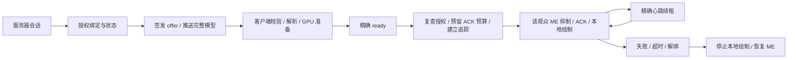

# MEPlayerActions 架构

本文对应服务端和客户端 0.6.1。安装与命令见 [README](README.md)，开发流程见 [CONTRIBUTING](CONTRIBUTING.md)，消息字段与限制以 [协议](docs/CLIENT_PROTOCOL.md) 为准。

## 职责

| 组件 | 职责 |
| --- | --- |
| Paper / GSit | 真实玩家实体、移动、碰撞、载具及姿态；GSit 为可选姿态后端 |
| ModelEngine | 导入蓝图、生成原版资源、向未被客户端接管的观众显示模型 |
| CraftEngine 或其他资源包服务 | 合并、托管和下发原版资源包，独立于 MPA 模型推送 |
| MPA 服务端 | 管理伪装与受管动作、观众许可、完整原模型推送及显示接管；可独立中继私人模型 |
| Fabric 客户端 | 加载本地与获准服务器模型，计算动画、绘制模型，提供图库、设置和轮盘 |

服务器伪装当前使用 ModelEngine R4.1.1；插件入口通过反射隔离这个可选后端。没有可用的 ME 时，同一 JAR 进入私人多人同步模式，不能提供服务器伪装。客户端不引用 Bukkit、ME 或 GSit；更换服务器引擎需要服务端实现相同的资产、绑定、追踪与接管语义。

三条路径分别是本地私人外观、服务器中继私人多人分享、服务器 ME 伪装。本地外观不发送资源；私人分享使用独立权限与频道，服务器只校验、缓存和分发完整资源，不执行 YSM 脚本、不创建 ME 蓝图或伪装实体。服务器伪装发送完整原 `.bbmodel`，不依赖原版资源包恢复已烘焙的表达式，只有当前授权绑定可获得资产 offer。配置与模型放置见 [模型部署](docs/MODEL_DELIVERY.md)。

## 模块索引

服务端：

| 模块 | 入口与用途 |
| --- | --- |
| 启动与后端 | [MEPlayerActionsPlugin](src/main/java/com/simmc/meplayeractions/MEPlayerActionsPlugin.java)、[ServerBackend](src/main/java/com/simmc/meplayeractions/server/ServerBackend.java)、[ModelEngineBackend](src/main/java/com/simmc/meplayeractions/me/ModelEngineBackend.java)、[PrivateOnlyBackend](src/main/java/com/simmc/meplayeractions/server/PrivateOnlyBackend.java) |
| 配置与命令 | [config/](src/main/java/com/simmc/meplayeractions/config/)、[CommandLayout](src/main/java/com/simmc/meplayeractions/command/CommandLayout.java)、[ActionMenu](src/main/java/com/simmc/meplayeractions/ui/ActionMenu.java) |
| 动作会话 | [ActionController](src/main/java/com/simmc/meplayeractions/action/ActionController.java)；[action/](src/main/java/com/simmc/meplayeractions/action/) 中的姿态、移动、跳跃、交互、视觉历史与分批发现 |
| ME 与观众 | [ModelEngineBridge](src/main/java/com/simmc/meplayeractions/me/ModelEngineBridge.java)、[ModelAudience](src/main/java/com/simmc/meplayeractions/me/ModelAudience.java)；创建或接管模型，按观众选择显示路径 |
| 原版实体追踪 | [NativeEntityRelay](src/main/java/com/simmc/meplayeractions/me/NativeEntityRelay.java) 与 `NativeEntity*`；异步安装通道，保护授权玩家的原版追踪包及恢复配对 |
| 通信与资产 | [ClientSyncService](src/main/java/com/simmc/meplayeractions/client/ClientSyncService.java)、[ModelAssets](src/main/java/com/simmc/meplayeractions/client/ModelAssets.java)、[ServerTemplatePreparation](src/main/java/com/simmc/meplayeractions/me/ServerTemplatePreparation.java)、[RenderLeases](src/main/java/com/simmc/meplayeractions/client/RenderLeases.java)、[ConnectionLimits](src/main/java/com/simmc/meplayeractions/client/ConnectionLimits.java) |
| 私人分享 | [PrivateModelSyncService](src/main/java/com/simmc/meplayeractions/client/PrivateModelSyncService.java)、[PrivateModelBundle](src/main/java/com/simmc/meplayeractions/client/PrivateModelBundle.java)、[PrivateModelStore](src/main/java/com/simmc/meplayeractions/client/PrivateModelStore.java)、[PrivateAudienceCache](src/main/java/com/simmc/meplayeractions/client/PrivateAudienceCache.java) |
| 资源保护 | [ResourceProtection](src/main/java/com/simmc/meplayeractions/protection/ResourceProtection.java)、[ResourceSettings](src/main/java/com/simmc/meplayeractions/protection/ResourceSettings.java)、[ResourceError](src/main/java/com/simmc/meplayeractions/protection/ResourceError.java)；共享有界任务、内存／网络与关系预算、保护状态及轻量指标 |
| 玩法与表达式 | [gameplay/](src/main/java/com/simmc/meplayeractions/gameplay/) 管理真实姿态、飞行与药水所有权；[expression/](src/main/java/com/simmc/meplayeractions/expression/) 与 [YsmAnimations](src/main/java/com/simmc/meplayeractions/me/YsmAnimations.java) 处理有界脚本及实例物理 |

客户端源码位于 `client/src/main/java/com/simmc/meplayeractions/client/`：

| 模块 | 入口与用途 |
| --- | --- |
| 启动与运行时 | [MEPlayerActionsClient](client/src/main/java/com/simmc/meplayeractions/client/MEPlayerActionsClient.java)、[ClientRuntime](client/src/main/java/com/simmc/meplayeractions/client/ClientRuntime.java)；注册频道、J 入口、生命周期、绑定与后台加载 |
| 网络 | [network/](client/src/main/java/com/simmc/meplayeractions/client/network/)；严格消息解析、offer 授权、资产传输、磁盘缓存、私人分享与增量状态 |
| 模型与动画 | [model/](client/src/main/java/com/simmc/meplayeractions/client/model/)；BBModel、YSM 文件、控制器、采样、原生格式与独立实例状态 |
| 原版输入 | `EntityAnimationController`、`VanillaYsm*`、`YsmNativeInputState`；按实体姿态、交互及持物驱动模型 |
| 渲染 | [render/](client/src/main/java/com/simmc/meplayeractions/client/render/)、[mixin/](client/src/main/java/com/simmc/meplayeractions/client/mixin/)；冻结帧、模型、手持物、原版人物与装备层、第一人称手臂 |
| UI 与偏好 | [ui/](client/src/main/java/com/simmc/meplayeractions/client/ui/)、`ClientOptions`、`LocalAppearanceSettings`、`WheelPreferences`；图库、预览、作者表单、轮盘与保存 |

Gradle 复用服务端 `expression/` 和纯配置代码，排除 Bukkit 配置类。两端表达式解释器保持同一实现；可变变量、时间线、控制器和弹簧状态仍按实例隔离。

## 服务器伪装生命周期

每个受管玩家有独立 `instance`，更换模型或参数结束旧实例。动作层分为姿态、交互、手动；层缺席意味着退出，重复状态不会重启动画。`attach` 只管理外部模型的动作层，不取得模型销毁或客户端渲染替换的所有权。

接管按观看者进行。服务器先核对当前身份、资产、权限与观众范围，并预留 ACK 出站预算；预算忙或追踪通道尚在安装时保持 ME 显示。通道准备成功后才启用该观众的例外、建立租约并发送 ACK，客户端收到精确 ACK 才绘制。混合实体包仍保留顺序，未授权实体继续经过 ME。

断线、过期、超距、资产或绘制失败都撤销对应观看者的接管。解除自有伪装时恢复仍合法追踪的原版玩家配对。配置重载结束旧会话；清理只恢复本插件仍持有的模型、动画、姿态和字段所有权，保留外部修改。

## 本地与私人多人模型

纯本地外观使用自己的模型选择、配置与动画生命周期，没有服务器插件也能使用。本人服务器伪装与私人外观互斥：服务器绑定期间暂停私人显示、动作与分享，浏览客户端图库不改变当前模型。解除服务器伪装后显示原版人物，私人配置保留，须显式使用私人模型才重新启用。

私人多人分享须客户端显式开启、服务器启用及发布/观看权限同时满足。客户端将选中的 `.ysm`、YSM 目录／ZIP 或自包含 `.bbmodel` 导出为完整原生 bundle，由服务器向符合追踪和观众条件的模组玩家签发 offer；原版玩家继续看到原版人物。服务器伪装期间不能启用私人模型或上传分享。

服务器磁盘缓存按上传者 UUID 与内容 hash 隔离，保留已验证完整资源，同一上传者再次选择时仍需当次权限与重新校验才能发布。clear、离线或撤权结束展示，不因缓存存在保留观众租约；资源缓存也不是管理员公开模型目录。观众 offer、资源确认、ready／ACK、状态合并与重试各有独立生命周期。协议与预算见 [私人同步](docs/CLIENT_PROTOCOL.md#私人模型同步-v1)，用户开关见 [客户端配置](docs/CLIENT_CONFIG.md)。

## 时序、线程与关键约束

- 控制任务每 tick 运行，采样与动作切换各受配置间隔控制，默认均为 1 tick；服务器物理及视觉历史继续按控制任务维护。客户端普通状态每游戏 tick 采样，模型动画与绘制按帧执行。重观众发现、关系复查和自动接管分开调度，默认与边界见 [性能说明](docs/PERFORMANCE.md)。缓存只共享不可变模板、目录或观众身份。
- 所有客户端模型位置复用已追踪玩家的原版当帧渲染状态，不叠加位置缓冲。`followServerTimeline` 只选择服务器动画层与时间线；没有实体时不绘制幽灵模型。
- 普通锚点为玩家脚底，原生床与 GSit 接触面分开处理；卧倒由作者动画负责，避免再叠加整模型姿态旋转。缩放和视觉延迟不改变真实碰撞或坐标。
- Bukkit 模型、玩法和授权操作在主线程；资产校验使用后台工作。Netty 安装不阻塞主线程，完成结果必须重新核对连接、实例与权限。
- 资源工作由共享固定线程池和有界队列执行，排队、运行与待主线程结果各自有数量／字节上限；拒绝不会在调用线程补跑。主线程先快检，后台读写、校验与准备不可变资源，回调再核对生命周期和授权。取消运行作业时，实际退出前保留其工作预留。
- 两同步频道共用全服上下行、包数与传输额度，私人资源继续有自身子预算。保护状态按服务器与本插件压力分级，先减速，再暂停新增，紧急时分批清理自有实例；安全撤销、必要确认和退出处理继续。全局 `status` 读取运行指标快照，配置、恢复与 API 边界见 [资源保护](docs/SERVER_RESOURCE_PROTECTION.md)。
- ME 渲染线程只读不可变偏移；Netty 处理器只读已发布实体集合。客户端绑定和 GPU 安装回到 Minecraft 主线程，绘制阶段只消费冻结几何；所有后台结果受生命周期标识约束。
- 资源重载释放显示租约、恢复后端，再准备 GPU 和重新确认；磁盘缓存及持久用户配置不等于当前显示授权。
- 服务器动作请求只操作本人且经过目录与权限校验。模型解释器不执行宿主代码、任意文件或网络；资源验证和限流不构成 DRM，已下发资产无法撤回。

支持格式与限制见 [YSM 兼容性](docs/YSM_COMPATIBILITY.md)，代码和模型资源许可见 [第三方说明](THIRD_PARTY_NOTICES.md)。
